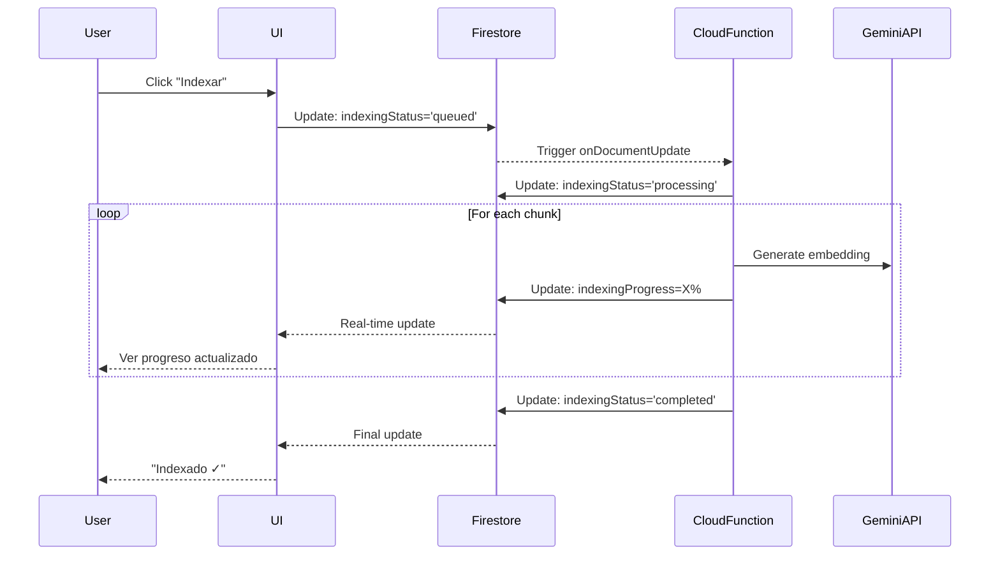

# Server-Side Indexing Implementation Plan

## Objetivo
Mover el proceso de indexación (generación de embeddings) del cliente al servidor para:
1. No depender de la conexión del usuario
2. Mostrar progreso en tiempo real de múltiples documentos
3. Permitir que el usuario cierre la página y vuelva a ver el estado

## Arquitectura Propuesta

---

## Proposed Changes

### Domain Layer

#### [MODIFY] [LibraryResource.ts](file:///Users/ricardocerda/dev/dosfilos-app/packages/domain/src/entities/LibraryResource.ts)
Agregar campos para tracking de indexación:
- `indexingStatus`: 'idle' | 'queued' | 'processing' | 'completed' | 'error'
- `indexingProgress`: number (0-100)
- `indexingError?`: string
- `indexingStartedAt?`: Date
- `indexingCompletedAt?`: Date
- `chunksProcessed?`: number
- `totalChunks?`: number

---

### Cloud Functions

#### [NEW] [indexDocument.ts](file:///Users/ricardocerda/dev/dosfilos-app/packages/functions/src/library/indexDocument.ts)
Cloud Function que:
1. Se dispara con `onDocumentUpdate` cuando `indexingStatus` cambia a 'queued'
2. Lee el documento de Firestore
3. Chunking del texto
4. Para cada chunk batch:
   - Genera embeddings con Gemini
   - Guarda en vector store
   - Actualiza `indexingProgress` en Firestore
5. Al completar: `indexingStatus='completed'`
6. En error: `indexingStatus='error'` + mensaje

---

### Application Layer

#### [MODIFY] [LibraryService.ts](file:///Users/ricardocerda/dev/dosfilos-app/packages/application/src/services/LibraryService.ts)
- Cambiar `indexResource()` para solo actualizar Firestore con `indexingStatus='queued'`
- Ya no hace el processing en el cliente

---

### Web Layer

#### [MODIFY] [LibraryManager.tsx](file:///Users/ricardocerda/dev/dosfilos-app/packages/web/src/pages/library/LibraryManager.tsx)
- Usar `onSnapshot` para escuchar cambios en tiempo real
- Mostrar barra de progreso por cada recurso
- Mostrar estado: "En cola", "Procesando 45%", "Completado", "Error"

---

## Verification Plan

### Manual Verification
1. Subir un documento y hacer clic en "Indexar"
2. Verificar que el estado cambia a "En cola" → "Procesando" con progreso
3. Cerrar la página y volver - debe mostrar el estado actual
4. Subir múltiples documentos y ver progreso simultáneo
5. Simular error (documento sin texto) y verificar estado de error
