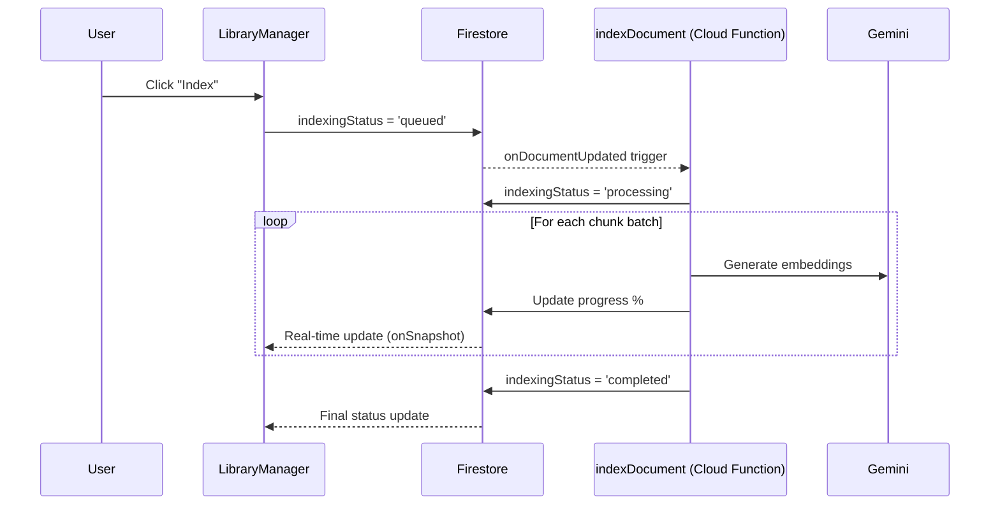

# Server-Side Indexing Implementation

## Overview

Implemented server-side document indexing using Firebase Cloud Functions. This allows users to queue documents for indexing and close the browser - the server will continue processing independently with real-time progress updates.

## Architecture

## Files Changed

### Domain Layer
#### [LibraryResource.ts](file:///Users/ricardocerda/dev/dosfilos-app/packages/domain/src/entities/LibraryResource.ts)
- Added `IndexingStatus` type: `'idle' | 'queued' | 'processing' | 'completed' | 'error'`
- Added indexing fields: `indexingStatus`, `indexingProgress`, `indexingError`, `indexingStartedAt`, `indexingCompletedAt`, `chunksProcessed`, `totalChunks`

---

### Cloud Functions
#### [NEW] [indexDocument.ts](file:///Users/ricardocerda/dev/dosfilos-app/packages/functions/src/library/indexDocument.ts)
- Triggers on Firestore document update when `indexingStatus` changes to `'queued'`
- Chunks text server-side
- Generates embeddings with Gemini in batches
- Updates progress in real-time to Firestore
- Handles errors gracefully

---

### Infrastructure
#### [FirebaseLibraryRepository.ts](file:///Users/ricardocerda/dev/dosfilos-app/packages/infrastructure/src/firebase/FirebaseLibraryRepository.ts)
- Added `update()` method
- Updated conversion methods to handle indexing fields

---

### Application
#### [LibraryService.ts](file:///Users/ricardocerda/dev/dosfilos-app/packages/application/src/services/LibraryService.ts)
- `indexResource()` now only sets `indexingStatus = 'queued'` instead of processing client-side

---

### Web UI
#### [LibraryManager.tsx](file:///Users/ricardocerda/dev/dosfilos-app/packages/web/src/pages/library/LibraryManager.tsx)
- Uses Firestore `onSnapshot` for real-time resource updates
- Shows server-side indexing status: "En cola", "45%", "Indexado", "Error"
- Progress bar updates in real-time as server processes

## How to Test

1. **Navigate to Library** (`/library`)
2. **Upload a PDF** if not already uploaded
3. **Click the index button** (sparkles icon)
4. **Observe:** Status changes from "Sin indexar" → "En cola" → "XX%" → "Indexado"
5. **Test resilience:** Close the browser tab while indexing is in progress
6. **Reopen:** Should show current progress or completed status

## Key Benefits

| Benefit | Description |
|---------|-------------|
| **Resilience** | Processing continues even if user closes browser |
| **Multi-document** | Users can queue multiple documents simultaneously |
| **Real-time UI** | Progress updates automatically via Firestore listeners |
| **Error handling** | Failed indexations show error status without crashing |
