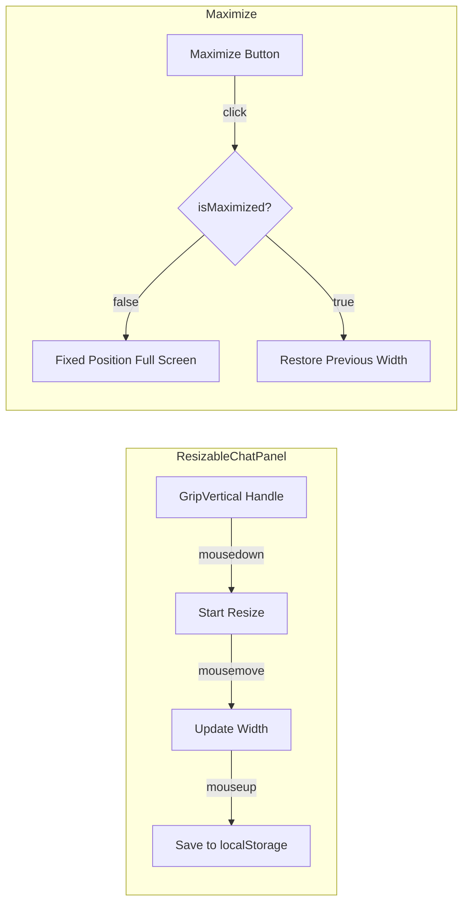

# Generator Assistant Upgrade - Walkthrough

**Date**: December 2024  
**Feature**: Enhanced generator assistant with RAG, coaching styles, and resizable panel

## Summary

Successfully upgraded the sermon generator assistant with advanced features from the planner assistant:

- **RAG Integration**: Searches user's library documents for relevant context during chat
- **Coaching Styles**: Users can select between Automatic, Socratic, Direct, Exploratory, or Didactic modes
- **Persistent History**: Chat history saved per sermon/phase in localStorage with 7-day TTL
- **Source References**: AI responses show collapsible source citations
- **Resizable Panel**: Drag left edge to resize, or maximize to fullscreen

---

## Files Created/Modified

### New Components

#### `packages/application/src/services/GeneratorChatService.ts` (NEW)

Service providing AI chat for the generator wizard:

| Method | Description |
|--------|-------------|
| `initializeForSermon(sermonId, phase)` | Initializes service for a specific sermon/phase |
| `setCoachingStyle(style)` | Sets user's preferred coaching approach |
| `sendMessage(message, context)` | Sends message with RAG-enabled context |
| `getHistory()` | Returns persisted message history |
| `clearHistory()` | Clears current session |

**Key Features:**
- Sermon-scoped localStorage persistence
- 7-day TTL with automatic cleanup
- RAG search across full library + phase-specific documents
- Coaching strategy selection via `AutomaticStrategySelector`

---

#### `packages/web/src/components/canvas-chat/ResizableChatPanel.tsx` (NEW)

Reusable wrapper providing:
- **Drag-to-resize**: Grab the left edge (GripVertical icon) and drag
- **Maximize/Minimize**: Button in top-right corner for fullscreen mode
- **Persistent width**: Saves panel width to localStorage per step

```typescript
<ResizableChatPanel storageKey="exegesisChatWidth">
    <ChatInterface {...props} />
</ResizableChatPanel>
```

---

### Modified Components

#### `packages/web/src/components/canvas-chat/ChatInterface.tsx`

Enhanced with new props:

```typescript
interface ChatInterfaceProps {
    // ... existing props
    showStyleSelector?: boolean;
    selectedStyle?: CoachingStyle | 'auto';
    onStyleChange?: (style: CoachingStyle | 'auto') => void;
}
```

**UI Additions:**
- Coaching style dropdown in header (when `showStyleSelector=true`)
- Collapsible sources section below each AI message
- Strategy badge showing which coaching mode was used

---

### Wizard Steps Integration

All three generator wizard steps now use `GeneratorChatService` and `ResizableChatPanel`:

| Step | Storage Key | Phase |
|------|-------------|-------|
| `StepExegesis.tsx` | `exegesisChatWidth` | `WorkflowPhase.EXEGESIS` |
| `StepHomiletics.tsx` | `homileticsChatWidth` | `WorkflowPhase.HOMILETICS` |
| `StepDraft.tsx` | `draftChatWidth` | `WorkflowPhase.DRAFTING` |

---

## Architecture

### ResizableChatPanel Flow



### Configuration

| Property | Value |
|----------|-------|
| Min Width | 320px |
| Max Width | 800px |
| Default Width | 384px (Tailwind's w-96) |
| Cursor | `col-resize` during drag |
| Visual Feedback | Blue highlight on handle when dragging |

---

### GeneratorChatService RAG Flow

```mermaid
flowchart TB
    subgraph User Input
        A[User sends message] --> B{Section expanded?}
    end
    
    subgraph Processing
        B -->|Yes| C[Section-specific refinement]
        B -->|No| D[GeneratorChatService.sendMessage]
        D --> E[Load library resources]
        E --> F[RAG search for relevant chunks]
        F --> G[Select coaching strategy]
        G --> H[Generate AI response]
    end
    
    subgraph Output
        H --> I[Response with sources]
        I --> J[Display in ChatInterface]
        J --> K[Show strategy badge]
        J --> L[Show collapsible sources]
    end
    
    subgraph Persistence
        D --> M[Save to localStorage]
        M --> N[Key: generator_chat_history_{sermonId}_{phase}]
    end
```

---

## Testing Checklist

### Resizable Panel
- [x] Panel resizes by dragging left edge
- [x] Resize handle shows GripVertical icon on hover
- [x] Width persists after page refresh
- [x] Maximize button expands to fullscreen
- [x] Minimize button returns to previous width
- [x] Each step remembers its own width independently

### RAG & Coaching Styles
- [ ] Verify RAG with actual library documents
- [ ] Test coaching style selection affects AI responses
- [ ] Confirm sources display correctly in collapsible UI
- [ ] Strategy badges show correct coaching mode

### History Persistence
- [ ] Chat history persists across page refresh
- [ ] History is sermon-scoped (different sermons have different histories)
- [ ] History expires after 7 days (TTL cleanup)
