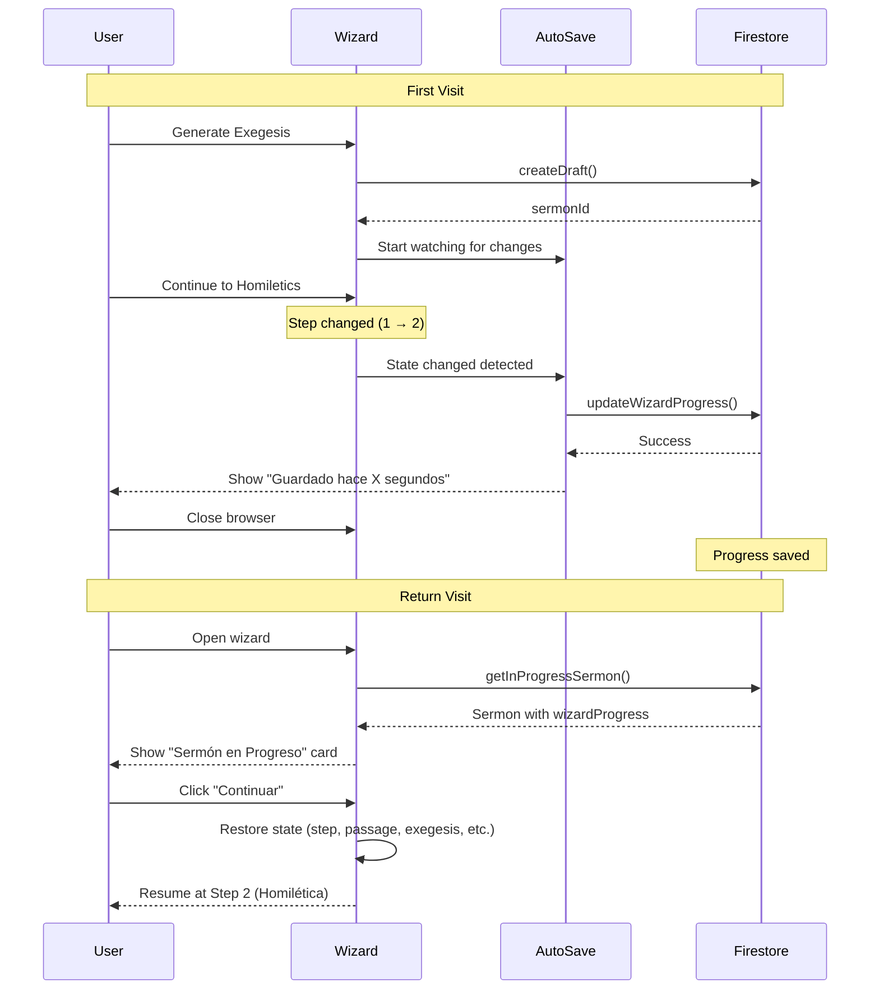

# Auto-Save Implementation - Complete Walkthrough

## Summary

Successfully implemented a complete auto-save system for the sermon generation wizard across 4 phases. The wizard now automatically saves progress, allows users to resume from where they left off, and provides clear feedback about save status.

---

## Phase 1: Extended Sermon Model ✅

### Added `wizardProgress` Field

Extended the `Sermon` interface to store intermediate wizard states:

```typescript
export interface Sermon {
  // ... existing fields
  
  wizardProgress?: {
    currentStep: number;
    passage: string;
    exegesis?: ExegeticalStudy;
    homiletics?: HomileticalAnalysis;
    draft?: SermonContent;
    lastSaved: Date;
  };
}
```

**Files Modified**:
- [Sermon.ts](file:///Users/ricardocerda/dev/dosfilos-app/packages/domain/src/entities/Sermon.ts)
- [SermonEntity](file:///Users/ricardocerda/dev/dosfilos-app/packages/domain/src/entities/Sermon.ts) - Updated constructor and methods
- [FirebaseSermonRepository.ts](file:///Users/ricardocerda/dev/dosfilos-app/packages/infrastructure/src/firebase/FirebaseSermonRepository.ts) - Added serialization
- [firestore.rules](file:///Users/ricardocerda/dev/dosfilos-app/firestore.rules) - Allowed empty content for drafts

---

## Phase 2: Intelligent Auto-Save ✅

### Created Change-Based Auto-Save Hook

**Key Innovation**: Auto-save only triggers when content **actually changes**, not on a timer.

```typescript
// Auto-save ONLY when content actually changes
useEffect(() => {
  if (!sermonId) return;

  const prev = previousStateRef.current;
  
  // Check if any content has actually changed
  const exegesisChanged = prev.exegesis !== wizardState.exegesis;
  const homileticsChanged = prev.homiletics !== wizardState.homiletics;
  const draftChanged = prev.draft !== wizardState.draft;
  const stepChanged = prev.step !== wizardState.step;

  // Only save if there's a real change
  if (exegesisChanged || homileticsChanged || draftChanged || stepChanged) {
    save();
  }
}, [wizardState.exegesis, wizardState.homiletics, wizardState.draft, wizardState.step]);
```

**Files Created**:
- [useAutoSave.ts](file:///Users/ricardocerda/dev/dosfilos-app/packages/web/src/hooks/useAutoSave.ts)

**Files Modified**:
- [WizardContext.tsx](file:///Users/ricardocerda/dev/dosfilos-app/packages/web/src/pages/sermons/generator/WizardContext.tsx)
- [SermonService.ts](file:///Users/ricardocerda/dev/dosfilos-app/packages/application/src/services/SermonService.ts) - Added `createDraft`, `updateWizardProgress`, `getInProgressSermon`

**Benefits**:
- ✅ No continuous saving (only on changes)
- ✅ No UI flickering or parpadeo
- ✅ Efficient Firestore usage
- ✅ Silent background operation

---

## Phase 3: Resume Functionality ✅

### Detect and Continue In-Progress Sermons

Created a seamless resume experience:

1. **On wizard mount**: Check for in-progress sermons
2. **Show prompt**: Display sermon details with "Continuar" or "Descartar" options
3. **Restore state**: Load all saved data (passage, exegesis, homiletics, draft, step)

**Files Created**:
- [SermonInProgress.tsx](file:///Users/ricardocerda/dev/dosfilos-app/packages/web/src/pages/sermons/generator/SermonInProgress.tsx)

**Files Modified**:
- [SermonWizard.tsx](file:///Users/ricardocerda/dev/dosfilos-app/packages/web/src/pages/sermons/generator/SermonWizard.tsx)

**User Experience**:
```
User closes browser → Progress saved
User returns later → "Sermón en Progreso" card appears
User clicks "Continuar" → Resumes at exact step with all data
User clicks "Descartar" → Deletes draft and starts fresh
```

**Firestore Index Required**:
- Composite index on `userId`, `status`, `updatedAt` (created via Firebase Console)

---

## Phase 4: UI Improvements ✅

### Added Save Status Display

Created a subtle save status indicator in the wizard header:

**Files Created**:
- [SaveStatus.tsx](file:///Users/ricardocerda/dev/dosfilos-app/packages/web/src/pages/sermons/generator/SaveStatus.tsx)

**Features**:
- Shows "Guardando..." with pulsing dot while saving
- Shows "Guardado hace X minutos" with relative time after save
- Uses `date-fns` for Spanish localization

### Added "Nuevo Sermón" Button

Allows users to start a new sermon while keeping the current draft:
- Confirms with user before resetting
- Current sermon remains saved in Firestore
- Can be resumed later

---

## Complete Flow Diagram



---

## Key Technical Decisions

### 1. Change-Based vs Time-Based Auto-Save

**Decision**: Use change detection instead of debounced timers

**Rationale**:
- Eliminates unnecessary saves
- Prevents UI flickering
- More efficient for Firestore
- Better user experience

### 2. Single In-Progress Sermon

**Decision**: Only track one in-progress sermon per user

**Rationale**:
- Simpler UX (no "which sermon to resume?" confusion)
- Matches typical workflow (finish one sermon before starting another)
- Can be extended later if needed

### 3. Draft Status for In-Progress Sermons

**Decision**: Use `status: 'draft'` for in-progress sermons

**Rationale**:
- Reuses existing status field
- Allows empty content (updated validation)
- Easy to filter and query

---

## Files Summary

### Created
1. `/packages/web/src/hooks/useAutoSave.ts` - Auto-save hook
2. `/packages/web/src/pages/sermons/generator/SermonInProgress.tsx` - Resume prompt component
3. `/packages/web/src/pages/sermons/generator/SaveStatus.tsx` - Save status display

### Modified
1. `/packages/domain/src/entities/Sermon.ts` - Added `wizardProgress` field
2. `/packages/infrastructure/src/firebase/FirebaseSermonRepository.ts` - Serialization
3. `/packages/application/src/services/SermonService.ts` - Wizard-specific methods
4. `/packages/web/src/pages/sermons/generator/WizardContext.tsx` - Auto-save integration
5. `/packages/web/src/pages/sermons/generator/SermonWizard.tsx` - Resume detection & UI
6. `/packages/web/src/pages/sermons/generator/StepExegesis.tsx` - Save indicator
7. `/packages/web/src/pages/sermons/generator/StepHomiletics.tsx` - Save indicator
8. `/firestore.rules` - Allow empty content for drafts

---

## Testing Performed

### Manual Testing ✅

1. **Auto-Save on Generation**:
   - Generated exegesis → Draft created in Firestore
   - Verified `wizardProgress.exegesis` saved correctly
   - Confirmed no continuous saving (only on changes)

2. **Auto-Save on Step Change**:
   - Clicked "Continuar a Homilética"
   - Verified `wizardProgress.currentStep` updated to 2
   - Confirmed save status displayed briefly

3. **Resume Functionality**:
   - Closed browser with sermon in progress
   - Reopened wizard → "Sermón en Progreso" card appeared
   - Clicked "Continuar" → Resumed at Step 2 with all data
   - Verified exegesis content fully restored

4. **Firestore Index**:
   - Created composite index via Firebase Console link
   - Waited ~2 minutes for index to build
   - Confirmed resume functionality works after index creation

---

## Next Steps

With auto-save complete, we're ready for:

1. **Canvas + Chat Interface** - Interactive editing workspace
2. **Homiletics & Draft Refactoring** - Apply executive summary approach
3. **Advanced Features** - Collaborative editing, version history, etc.

---

## Benefits Achieved

✅ **No data loss**: Progress saved automatically on every change  
✅ **Seamless UX**: Saving happens silently in background  
✅ **Resume capability**: Users can continue from where they left off  
✅ **Clear feedback**: Save status displayed with relative timestamps  
✅ **Efficient**: Only saves when content actually changes  
✅ **Foundation for Canvas + Chat**: Persistent state enables advanced workflows
